# Jenkinsfiles

This project contains pipeline script for CI/CD of Web Front End project in Jenkins.

## Rules

For we have regular release for various project and repositorites.

Folowing steps show about how we deal with release tasks.

So, all the pipline script should refer to these steps.

### Steps:

```mermaid
graph TD;
  Title(("📓 Repositories"))
  Title-->D

  subgraph branches
    subgraph develop
      D["✍️ Latest commit"]
    end

    subgraph release/*
      D-.At the last day before release period.->ReleaseNode["🆕 Create TimeStamped <br> Branch name"]
      ReleaseNode-.At the end of the release day.->D
    end

    subgraph hot-fix/*
      ReleaseNode-.create new branch.->H;
      H["🚑 Fix"]-.merge to release if QA pass.->ReleaseNode;
    end
  end

  subgraph Jenkins
    subgraph Release Tasks
      H-.Manually.->R1;
      D-->|"automatically"|R1["🌘 QA"]
      ReleaseNode-->|"manually"|R2["🌗 Staging"];
      ReleaseNode-->|"manually"|R3["🌕 Live"];
    end

    subgraph Pipelines
      R1-->J1
      R2-->J1
      R3-->J1
      J1["🔗 Checkout"]-->J2["🚚 Install"]
      J2-->J3["🐛 Test"]
      J3-->J4["📃 Build"]
      J4-->J5["☁️ Deploy to AWS S3 bucket"]
      J5-->J6["🗑 Delete Jenkins workspace"]
    end
  end
```

