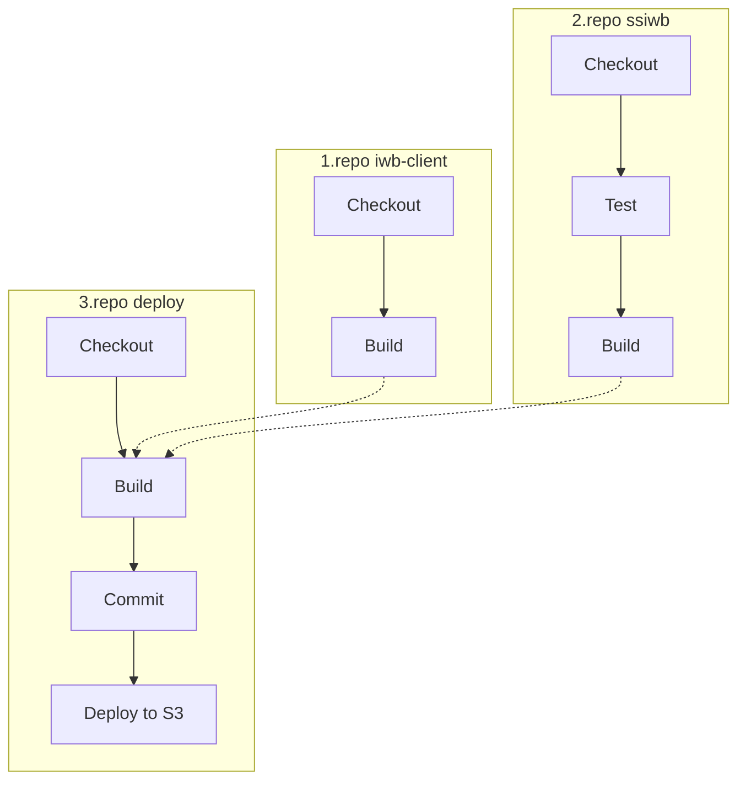

# Workflow

No QA env so far.

Staging, Live all follow the following steps.

```mermaid
graph TD;
    subgraph 1.repo iwb-client
        IC[Checkout]-->IB[Build]
    end
    subgraph 2.repo ssiwb
        SC[Checkout]-->ST[Test]
        ST-->SB[Build]
    end
    subgraph 3.repo deploy
        DC[Checkout]-->DB[Build]
        IB-.->DB
        SB-.->DB
        DB-->DCo[Commit]
        DCo-->DD[Deploy to S3]
    end
```
