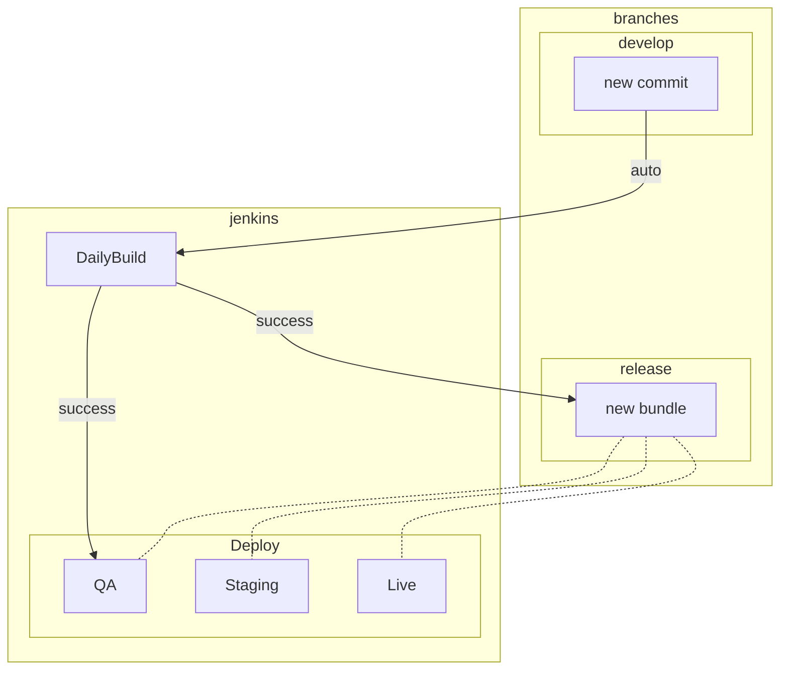

# Workflow

```mermaid
graph TD;
    subgraph branches
    subgraph develop
        C[new commit]
    end
    subgraph release
        RB[new bundle]
    end
    end
    subgraph jenkins
        C --> |auto|B["DailyBuild"]
        B --> |success|RB
        B --> |success|DQ

        subgraph Deploy
            DQ["QA"]
            DS["Staging"]
            DL["Live"]
            RB -.- DQ
            RB -.- DS
            RB -.- DL
        end
    end
```
